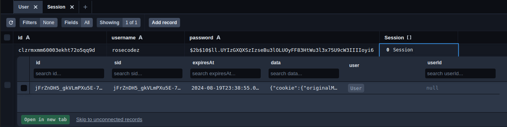

# File-Uploader

In this project, I am building a stripped down version of Google Drive

- set up session based authentication with Express, PassportJS and Prisma
- use of Prisma session store library to persist sessions in the database

Difficulties encountered:

- difficulty to add user to database with an id as "Int", for now I added the userId as "String"

