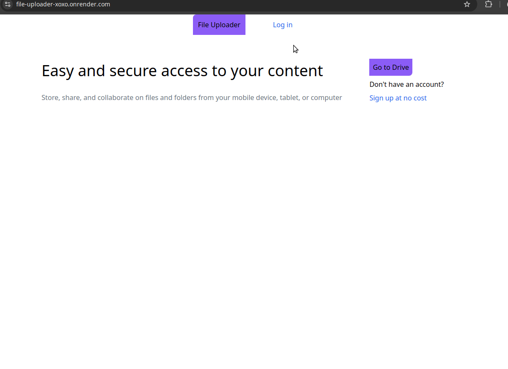

# File-Uploader

**Live Project**: https://file-uploader-xoxo.onrender.com/

**File-Uploader** is a full stack app that enables users to create, organize, and manage files and folders in a hierarchical structure.

## Demo

## Features

- **Nested tree structure**: For organizing folders and files
- **Session-based authentication**: With Express and PassportJS
- Persistent session storage using **Prisma session store**
- Rendering of **nested folders** and files using **EJS**
- **Direct file uploads** with Multer and Cloudinary
- **File download option**

## Technologies Used

- **Prisma & PostgreSQL**:ORM & relational database for structured data
- **Express.js**: Backend framework for RESTful APIs & middleware management
- **PassportJS**: Secure session-based authentication
- **Cloudinary**: File uploads & cloud storage
- **EJS**: Rendering dynamic content and folder/file displays

## Challenges Faced

- **Session persistence**: Ensured smooth login session handling across requests
- **Data Modeling with Prisma**: Ensuring model properties in Prisma matched the data types expected in the frontend to avoid type errors during CRUD operations.
- **Type Conversions**: Used parseInt to correctly process req.params for folder hierarchy

## Future Enhancements

- **Breadcrumb Navigation**: To improve user experience by providing easy navigation through the nested folder structure.
- **Alternative Cloud Storage Options**: Evaluate other storage providers like AWS S3, Google Cloud Storage, or Azure Blob Storage for better file type support and direct download capabilities.
- **Direct Download Links**: Implement a backend route to facilitate direct file downloads instead of redirecting to Cloudinary paths.
