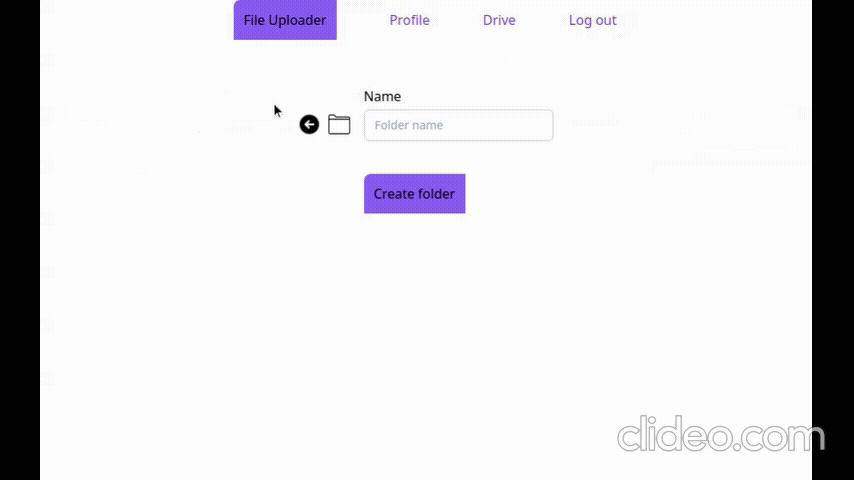

# File-Uploader

Live Project: https://file-uploader-xoxo.onrender.com/

File-Uploader is a full stack app that enables users to create, organize, and manage files and folders in a hierarchical structure.

## Features

- Nested tree structure for organizing folders and files
- Session-based authentication with Express and PassportJS
- Persistent session storage using Prisma session store
- Recursive rendering of nested folders and files using EJS
- Direct file uploads with Multer and Cloudinary
- File download option
- Handles various file types with type and size validation

## Technologies Used

- **Prisma**: For data modeling and managing PostgreSQL, offering type safety and easy migrations
- **PostgreSQL**: Relational database for managing hierarchical folder and file structures
- **Express.js**: Backend framework for building RESTful APIs and managing middleware
- **PassportJS**: Secure session-based authentication
- **Cloudinary**: File uploads
- **EJS**: For rendering dynamic content and recursive folder/file displays

## Challenges Faced

- **Session persistence**: Handling logged in user session
- **Data Modeling with Prisma**: Ensuring model properties in Prisma matched the data types expected in the frontend to avoid type errors during CRUD operations.
- **Type Conversions**: Handled `req.params` string to integer conversions using `parseInt`, critical for correctly linking parent-child relationships in the folder structure.

## Future Enhancements

- **Breadcrumb Navigation**: To improve user experience by providing easy navigation through the nested folder structure.
- **Alternative Cloud Storage Options**: Evaluate other storage providers like AWS S3, Google Cloud Storage, or Azure Blob Storage for better file type support and direct download capabilities.
- **Direct Download Links**: Implement a backend route to facilitate direct file downloads instead of redirecting to Cloudinary paths.
